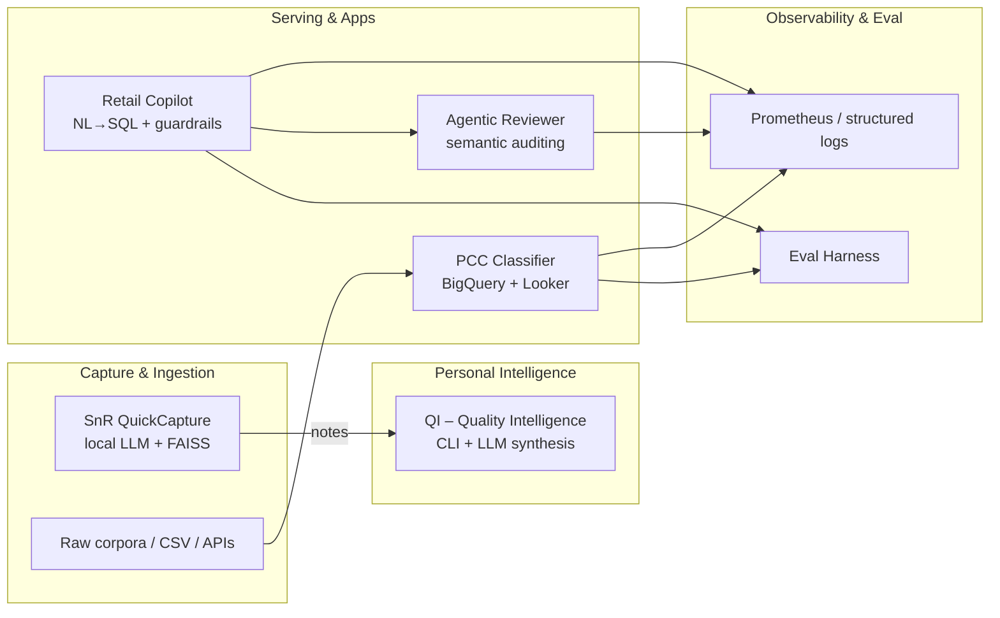
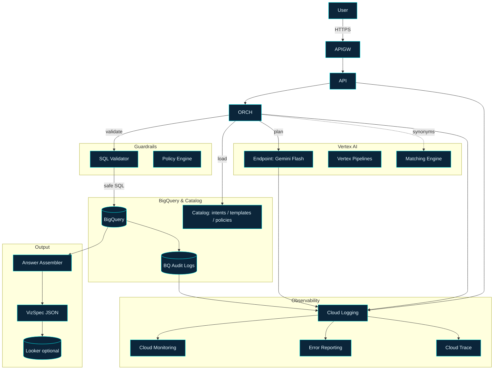
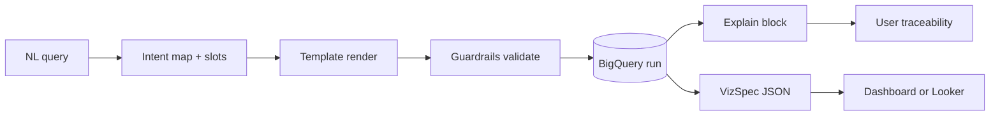

# Alejandro Garay — AI Engineer (NLP / RAG / Agentic Systems)

**I design, build, and evaluate end‑to‑end LLM‑based systems** — retrieval‑augmented generation, agentic workflows, semantic search, evaluation harnesses, and production‑grade serving. This repo is the **entry point** to my portfolio: code, architecture, and evidence.

**Last updated:** 2026‑02‑16

---

## At a glance

* **Primary vector:** AI/NLP **Engineer** — end‑to‑end LLM systems (RAG, agents, semantic search, classification, evals)
* **Differentiator:** symbolic‑linguistic rigor + production patterns (pipelines, orchestration, testing, observability) — not demo‑only prototypes
* **Background:** Linguistics / Translation → AI/NLP — retrieval‑first, auditable systems with evaluation you can trust


---

## Hiring signals (pattern → evidence)

| Real‑world pattern                             | What I built                          | Evidence                                                               | First file to open                                                       |
| ---------------------------------------------- | ------------------------------------- | ---------------------------------------------------------------------- | ------------------------------------------------------------------------ |
| Local‑first LLM ingestion + semantic search    | **SnR QuickCapture**                  | Neural parsing, hybrid SQLite+FAISS, deterministic normalizer, 99 tests | `snr-qc/README.md`                                                      |
| Signal accumulation + LLM narrative synthesis  | **Quality Intelligence (QI)**         | Feature engineering, rolling stats, Pydantic‑validated LLM output       | `qi/README.md`                                                           |
| NL→SQL with safety & multi‑tenancy            | **Retail Copilot**                    | Intent taxonomy, SQL templates, validation rules, golden‑set evals      | `retail-copilot/README.md` → `SOW_Dossier.md`                           |
| Post‑hoc guardrails / semantic auditing        | **Agentic Reviewer**                  | LLM verdict+reasoning loop, prompt‑injection detection, audit logging   | `agentic-reviewer/README.md` → `demo.py`                                |
| Productionized text classification             | **Privacy Case Classifier (PCC)**     | Live BigQuery pipeline, Looker dashboard, GCS model ingestion           | `pcc/README.md`                                                          |

---

## Architecture (portfolio map)



---

## Evaluation (RAG/LLM + systems)

**Retrieval metrics**

* `recall@k`: fraction of queries where at least one gold doc is in top‑k.
* `precision@k`: fraction of top‑k that are relevant.
* `MRR@k`: mean reciprocal rank of first relevant doc within k.
* `nDCG@k`: graded relevance with position discount.

**Answer‑level metrics**

* **Faithfulness**: proportion of claims grounded in retrieved context (LLM‑ or rule‑based).
* **Context utilization**: % of answer tokens attributable to provided context.
* **Answer correctness**: labeling via gold answers or rubric (exact/partial match).

**Operational**

* **Latency** `P50/P95`, **throughput** `RPS`, **cost/request**, **timeouts/error rate**, and **SLO/error budget** (e.g., `P95 < 800ms`, monthly error budget 0.5%).


---

## Observability

* **Stack:** `prometheus`, `grafana`, `opencensus` (exporters), structured JSON logs.
* Dashboards: `/observability/grafana/provisioning/` (panels for latency, RPS, errors, cost).
* Alerts: `/observability/alerts/` (ex: high P95, elevated 5xx, drift detector fired).
* Screenshots for reviewers: `/docs/img/observability_*.png`.

Run locally:

```bash
make up-metrics   # Grafana on http://localhost:3000 (admin/admin locally)
```

---

## Featured projects

### 1) SnR QuickCapture — Local‑First Note Capture with Neural Parsing

* **Problem**: capture thoughts instantly from anywhere on the desktop and turn them into semantically searchable, tagged knowledge — entirely offline.
* **Pattern**: global‑hotkey launcher → FastAPI "brain" → deterministic normalizer (skips LLM when confidence ≥ 0.7) → Ollama neural parser → hybrid SQLite + FAISS storage.
* **Stack**: Python 3.11+, FastAPI, Ollama (`qwen3:0.6b`), SentenceTransformers (`all-MiniLM-L6-v2`), SQLite (WAL), FAISS, PyQt6, Prometheus.
* **Evidence**: 99 normalization tests, 6‑layer reliability model ("never lose a note"), offline fallback + dead‑letter queue, drift detector, observability modules.
* **Start here**: `snr-qc/README.md`

### 2) QI — Quality Intelligence (Personal Development CLI)

* **Problem**: accumulate daily micro‑observations into computable signals and narrative reports over 52 weeks — under 2 min/day friction.
* **Pattern**: Capture (DCI + SnR QC import) → Heuristic event classifier → Feature engine (rolling stats, deltas, streaks, trends) → Deterministic weekly/monthly reports → optional LLM narrative synthesis via Ollama.
* **Stack**: Python 3.11+, Typer, Rich, Pydantic v2, SQLite, httpx, Ollama.
* **Evidence**: Pydantic‑validated LLM output contract, `llm_runs` observability table (timing, tokens, validation), schema‑versioned migrations, graceful degradation on LLM failure.
* **Integration**: consumes SnR QuickCapture notes via direct DB import (`qi import-snr-db`), reuses QC's parsed metadata to avoid redundant LLM calls.
* **Start here**: `qi/README.md`

### 3) Retail Copilot — NL→SQL with Safety & Multi‑Tenancy

* **Problem**: convert natural language queries into validated SQL + VizSpec JSON over BigQuery with safe multi‑tenant execution.
* **Pattern**: NL→intent→slots→template→validator chain; spec‑first architecture with PoC→MVP→multi‑tenant evolution path.
* **Implementation**: 35+ page architecture dossier; planner JSON, SQL templates, validation rules, tenant isolation (RLS/CLS), golden‑set eval, promotion gates. OSS demo: modular monolith (core/interfaces/adapters/ui) with DuckDB simulating BigQuery + Gemini adapter.
* **Evidence**: Intent taxonomy, SQL policies, router/planner prompts, test scaffolds, monitoring dashboards, SLOs.
* **Start here**: `retail-copilot/README.md` → `SOW_Dossier.md`
* **Repo**: PoC [repo](https://github.com/naaas94/retail-copilot-gcp) to back SOW

#### Architecture diagrams

**System context**



**Data lineage (NL to Viz)**



### 4) Agentic Reviewer — Semantic Auditing for Classification

* **Problem**: audit text classification predictions through semantic evaluation, corrections, and traceable explanations.
* **Pattern**: unified multi‑task LLM agent (evaluate → propose → reason) in a single call, with circuit breaker, LRU caching, and prompt‑injection detection.
* **Stack**: Python 3.11+, FastAPI, Ollama (Mistral), SQLite audit log, Pydantic.
* **Evidence**: REST API with review/metrics/security/drift endpoints, security layer (sanitization, rate limiting), full audit trail, RAG edition planned.
* **Start here**: `agentic-reviewer/README.md` → `demo.py`

### 5) PCC — Privacy Case Classifier

* **Problem**: classify customer support messages into privacy intent categories (GDPR/CCPA compliance).
* **Pattern**: supervised text classification (MiniLM + TF‑IDF embeddings, 584‑dim) → BigQuery orchestration → Looker dashboard → GCS model lifecycle.
* **Stack**: BigQuery, scikit‑learn, MiniLM, Docker, GCS, Looker.
* **Evidence**: live production BigQuery tables with daily inference, Looker dashboard ([link](https://lookerstudio.google.com/reporting/9cb78e63-f5a4-4c5b-95b2-3056171628a6/page/SuJRF)), automatic GCS model ingestion with version management, 95%+ confidence scores.
* **Start here**: `pcc/README.md`

### Other repos (supporting / reference)

* **MTP** (`mtp/`) — sklearn training pipeline with dataset gates, hyperparameter search, and GCS model registry; useful as a generic train/eval scaffold.
* **SMA** (`simple-model-api/`) — FastAPI + Prometheus + Docker serving template with `/metrics` and structured logs.

---

## Operating standards (applies to all repos)

* [x] Pinned dependencies & lockfiles
* [x] Deterministic seeds & reproducible runs
* [x] Makefile targets for common actions
* [x] CI: lint (`ruff`), typecheck (`mypy`/`pyright`), tests (`pytest`)
* [x] Structured logs + metrics hooks
* [x] Minimal data fixtures checked into repo
* [x] Doc: Quickstart + E2E path ≤10 minutes

---

## About me

I come from **linguistics and translation** (B.Sc. Technical‑Scientific Translation, B.Ed. English Language Teaching). I use that symbolic lens to design reliable NLP systems: clear problem framing, careful retrieval/representation choices, and evaluation you can trust.

Most recently at **Spotify** (Sep 2024 – Jul 2025) as Data Scientist on Customer Experience & Privacy, where I designed privacy‑compliant NLP pipelines (classification, semantic retrieval with FAISS), partnered with Legal/Ops to translate regulation into system constraints, and prototyped a symbolic‑LLM hybrid reviewer for auditing model behavior.

Currently based in **Buenos Aires, Argentina**.

* **GitHub:** [github.com/naaas94](https://github.com/naaas94)
* **LinkedIn:** [linkedin.com/in/alejandro-garay-frontini](https://www.linkedin.com/in/alejandro-garay-frontini/)
* **Email:** alejandroa.garay.ag@gmail.com
